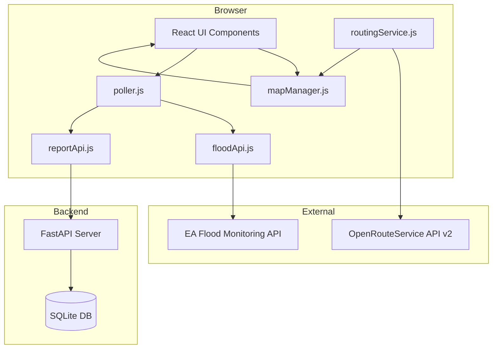

# Design Document — Water Watch: UK Flood Monitor

## Overview

Water Watch is a real-time UK flood monitoring single-page application. It fetches live flood warnings from the Environment Agency API, renders colour-coded flood zones on a Mapbox GL JS map, lets members of the public report hazards and request safe driving routes, and provides an Emergency Services Mode for operators to place shelters and mark high-risk zones.

The current codebase is a single `index.html` + `mockData.js`. This design targets the planned React + Vite architecture while remaining compatible with the existing plain-HTML prototype. All data-fetching and map-management logic is isolated in modules so the migration is incremental rather than a full rewrite.

### Key External Dependencies

| Dependency | Purpose | Notes |
|---|---|---|
| Mapbox GL JS v3 | Map rendering, layers, popups | Token required |
| UK EA Real-Time Flood Monitoring API | Live flood warnings + GeoJSON polygons | Public, no key |
| OpenRouteService API v2 | Safe driving route calculation | `avoid_polygons` parameter |
| Turf.js `@turf/buffer` | 200 m buffer around flood zones | Client-side |
| FastAPI + SQLite | Hazard report storage and retrieval | `POST /reports`, `GET /reports` |

---

## Architecture

The application is split into three logical tiers:



### Module Responsibilities

- **`src/api/floodApi.js`** — fetches flood warnings and polygon GeoJSON from the EA API; no DOM access.
- **`src/api/reportApi.js`** — `POST /reports` and `GET /reports` against the FastAPI backend; no DOM access.
- **`src/map/mapManager.js`** — owns the Mapbox GL JS `Map` instance; exposes methods for adding/updating sources and layers; no business logic.
- **`src/services/routingService.js`** — buffers flood zones with Turf.js and calls ORS; returns a GeoJSON LineString.
- **`src/services/poller.js`** — manages `setInterval` timers for flood data (60 s) and reports (10 s); exposes `start()` / `stop()` so React `useEffect` cleanup can replace them.
- **`src/components/`** — React components (header, legend, modals, buttons) that read state and call service methods.

---

## Components and Interfaces

### floodApi.js

```ts
fetchFloodWarnings(): Promise<FloodWarning[]>
fetchFloodPolygon(polygonUrl: string): Promise<GeoJSON.Feature | null>
fetchFloodPolygons(): Promise<FloodPolygonResult[]>
```

`fetchFloodPolygons` normalises each EA API item into a `FloodPolygonResult`:
- Extracts the first Feature from a FeatureCollection response.
- Attaches `severityLevel` (integer), `severity` (string), `description`, `floodAreaID`, `riverOrSea` as GeoJSON properties.
- Skips items with no polygon URL or failed polygon fetches.

### reportApi.js

```ts
postReport(report: ReportPayload): Promise<void>
getReports(): Promise<Report[]>
```

### mapManager.js

```ts
init(containerId: string, token: string): Map
setFloodData(geojson: GeoJSON.FeatureCollection): void   // upserts source, does not remove layers
setReportMarkers(reports: Report[]): void
setRoute(geojson: GeoJSON.Feature | null): void          // null clears the route layer
addShelter(lngLat: [number, number]): string             // returns shelter id
addHighRiskZone(polygon: GeoJSON.Feature): string        // returns zone id
```

### routingService.js

```ts
computeSafeRoute(
  origin: [number, number],
  destination: [number, number],
  floodFeatures: GeoJSON.Feature[]
): Promise<GeoJSON.Feature>   // throws RouteNotFoundError if ORS returns no route
```

Internally:
1. Buffers each flood feature by 200 m using `@turf/buffer`.
2. Unions all buffers into a single MultiPolygon.
3. POSTs to `https://api.openrouteservice.org/v2/directions/driving-car/geojson` with `avoid_polygons`.

### poller.js

```ts
startFloodPoller(onData: (results: FloodPolygonResult[]) => void, intervalMs?: number): () => void
startReportPoller(onData: (reports: Report[]) => void, intervalMs?: number): () => void
// Both return a cleanup function (clearInterval wrapper)
```

### React Components

| Component | Responsibility |
|---|---|
| `<App>` | Root; holds global state; wires pollers via `useEffect` |
| `<Header>` | Title, status indicator, Emergency Mode toggle |
| `<MapView>` | Mounts `mapManager`; passes data updates as props |
| `<Legend>` | Severity colour key |
| `<ReportHazardButton>` | Floating button + modal form |
| `<GetMeOutButton>` | Floating button; triggers routing flow |
| `<EmergencyToolbar>` | Shelter + High-Risk Zone tools (visible in Emergency Mode) |

---

## Data Models

### FloodWarning (EA API item)

```ts
interface FloodWarning {
  floodAreaID: string;
  description: string;
  severityLevel: number;   // 1 Severe | 2 Warning | 3 Alert | 4 No longer in force
  severity: string;        // human-readable label
  floodArea: {
    polygon?: string;      // URL to GeoJSON polygon
    riverOrSea?: string;
  };
}
```

### FloodPolygonResult (internal)

```ts
interface FloodPolygonResult {
  feature: GeoJSON.Feature;   // geometry + normalised properties below
  warning: FloodWarning;
}

// feature.properties shape:
{
  severityLevel: number;
  severity: string;
  description: string;
  floodAreaID: string;
  riverOrSea: string;
}
```

### Report (hazard report)

```ts
interface ReportPayload {
  hazardType: string;          // dropdown value
  coordinates: [number, number]; // [lng, lat]
  description?: string;        // max 280 chars
}

interface Report extends ReportPayload {
  id: string;
  createdAt: string;           // ISO 8601
}
```

### Shelter / HighRiskZone (Emergency Mode, session-only)

```ts
interface Shelter {
  id: string;
  lngLat: [number, number];
  label?: string;
}

interface HighRiskZone {
  id: string;
  polygon: GeoJSON.Feature;
}
```

### FastAPI — SQLite Schema

```sql
CREATE TABLE reports (
  id          TEXT PRIMARY KEY,
  hazard_type TEXT NOT NULL,
  lng         REAL NOT NULL,
  lat         REAL NOT NULL,
  description TEXT,
  created_at  TEXT NOT NULL
);
```

### Severity Colour Map

| severityLevel | Fill colour | Opacity |
|---|---|---|
| 1 (Severe) | `#c0392b` | 45% fill / 80% outline |
| 2 (Warning) | `#e67e22` | 45% fill / 80% outline |
| 3 (Alert) | `#f1c40f` | 45% fill / 80% outline |
| 4 (No longer in force) | `#7f8c8d` | 45% fill / 80% outline |

---


## Correctness Properties

*A property is a characteristic or behavior that should hold true across all valid executions of a system — essentially, a formal statement about what the system should do. Properties serve as the bridge between human-readable specifications and machine-verifiable correctness guarantees.*

### Property 1: EA API response parsing preserves all items

*For any* EA API response object containing an `items` array of N entries, `fetchFloodWarnings` should return an array of exactly N items with the same content.

**Validates: Requirements 1.2**

---

### Property 2: Only warnings with polygon URLs trigger a polygon fetch

*For any* array of flood warnings where some have `floodArea.polygon` set and some do not, `fetchFloodPolygons` should only attempt to fetch polygon GeoJSON for those that have a polygon URL, and should never call fetch for those without one.

**Validates: Requirements 1.3**

---

### Property 3: Flood warning normalisation correctness

*For any* EA API flood warning item, the normalised GeoJSON feature produced by `fetchFloodPolygons` should have `severityLevel` equal to the integer field from the warning (not the string), `severity` equal to the string field (not the integer), and the geometry should be the first Feature extracted from the FeatureCollection response.

**Validates: Requirements 1.4, 1.5**

---

### Property 4: Failed polygon fetches are skipped without halting

*For any* set of flood warnings where a subset of polygon URL requests fail or return no geometry, `fetchFloodPolygons` should return only the successfully loaded results, with no entry for the failed ones, and the count of results should equal the number of successful fetches.

**Validates: Requirements 1.7**

---

### Property 5: Severity level drives colour mapping

*For any* integer `severityLevel` in {1, 2, 3, 4}, the `severityColor` function should return the correct hex colour (`#c0392b`, `#e67e22`, `#f1c40f`, `#7f8c8d` respectively), and the Mapbox paint expression should reference `severityLevel` (the integer property), not the `severity` string property.

**Validates: Requirements 2.3**

---

### Property 6: Popup renders all required fields with correct severity class

*For any* flood zone feature with properties `description`, `severity`, `riverOrSea`, `floodAreaID`, and `severityLevel`, the rendered popup HTML should contain all four data fields and the severity badge element should carry the CSS class `sev-{severityLevel}` (e.g. `sev-1` through `sev-4`).

**Validates: Requirements 3.2, 3.3**

---

### Property 7: Report description length validation

*For any* string composed of more than 280 characters, submitting it as a report description should be rejected by the form validation, and no `POST /reports` request should be sent.

**Validates: Requirements 4.3**

---

### Property 8: Report POST payload completeness

*For any* valid report form submission with hazard type, coordinates, and optional description, the `POST /reports` request body should contain all three fields with the correct values.

**Validates: Requirements 4.4**

---

### Property 9: All fetched reports are rendered as markers

*For any* array of N reports returned by `GET /reports`, the map should display exactly N report markers, one for each report in the response.

**Validates: Requirements 4.7**

---

### Property 10: Report popup contains all required fields

*For any* report with `hazardType`, `description`, and `createdAt`, the rendered report popup HTML should contain all three values.

**Validates: Requirements 4.8**

---

### Property 11: Buffer zones contain original flood zone polygons

*For any* flood zone GeoJSON feature, the Turf.js 200 m buffer result should be a polygon that fully contains the original polygon (i.e. every point of the original is inside the buffer).

**Validates: Requirements 5.4**

---

### Property 12: ORS routing request includes all avoid polygons

*For any* origin, destination, and set of buffer zones, the routing request sent to ORS should include the origin and destination coordinates and an `avoid_polygons` parameter containing the union of all buffer zones.

**Validates: Requirements 5.5**

---

### Property 13: Only one route layer exists at a time

*For any* sequence of route calculations, after each new route is rendered the map should contain exactly one route layer, and it should correspond to the most recently calculated route.

**Validates: Requirements 5.9**

---

### Property 14: Shelter placement creates a marker at the correct location

*For any* lngLat coordinate pair, calling `addShelter(lngLat)` should result in exactly one shelter marker on the map at that coordinate.

**Validates: Requirements 6.4**

---

### Property 15: High-risk zone uses correct fill colour and opacity

*For any* polygon passed to `addHighRiskZone`, the rendered Mapbox layer should use fill colour `#8e44ad` at 40% opacity.

**Validates: Requirements 6.6**

---

### Property 16: Emergency mode deactivation retains shelters and high-risk zones

*For any* session state containing N shelters and M high-risk zones, deactivating Emergency Mode should leave all N shelters and M high-risk zones present on the map (only the operator tools are hidden).

**Validates: Requirements 6.7**

---

## Error Handling

| Scenario | Behaviour |
|---|---|
| EA API fetch fails | Status indicator shows error message; previously loaded flood data is retained in state |
| Individual polygon URL fetch fails | That warning is skipped; remaining warnings continue loading |
| `POST /reports` fails | Inline error shown inside modal; modal stays open |
| `GET /reports` fails | Non-blocking toast warning; map continues showing last known report markers |
| ORS returns no route | User-facing message: "No safe route found — please contact emergency services" |
| Geolocation denied / unavailable | Error message shown; manual location entry field is revealed |
| ORS request itself fails (network) | Same as no-route message, with additional note to try again |

All API modules throw typed errors (`FloodApiError`, `ReportApiError`, `RouteNotFoundError`, `GeolocationError`) so callers can distinguish failure modes without string-matching.

---

## Testing Strategy

### Dual Testing Approach

Both unit tests and property-based tests are required. They are complementary:
- Unit tests catch concrete bugs at specific inputs and verify integration points.
- Property-based tests verify universal correctness across the full input space.

### Property-Based Testing

**Library**: [fast-check](https://github.com/dubzzz/fast-check) (TypeScript/JavaScript).

Each property-based test must run a minimum of **100 iterations** and be tagged with a comment referencing the design property:

```
// Feature: flood-data-visualisation, Property N: <property text>
```

Each correctness property listed above must be implemented by a **single** property-based test.

Example skeleton:

```ts
import fc from 'fast-check';

// Feature: flood-data-visualisation, Property 3: Flood warning normalisation correctness
it('normalises severityLevel as integer and severity as string', () => {
  fc.assert(
    fc.property(
      fc.record({
        severityLevel: fc.integer({ min: 1, max: 4 }),
        severity: fc.string(),
        description: fc.string(),
        floodAreaID: fc.string(),
        floodArea: fc.record({ riverOrSea: fc.string() }),
      }),
      (warning) => {
        const feature = normaliseWarning(warning, mockFeature);
        expect(typeof feature.properties.severityLevel).toBe('number');
        expect(typeof feature.properties.severity).toBe('string');
        expect(feature.properties.severityLevel).toBe(warning.severityLevel);
        expect(feature.properties.severity).toBe(warning.severity);
      }
    ),
    { numRuns: 100 }
  );
});
```

### Unit Tests

Unit tests focus on:
- Specific examples: correct colour for each of the four severity levels, popup HTML for a known feature.
- Integration points: `mapManager.setFloodData` calls `getSource().setData()` rather than `removeLayer`/`addLayer`.
- Edge cases: empty `items` array from EA API, FeatureCollection with zero features, description exactly 280 chars (valid) vs 281 chars (invalid).
- Error conditions: each typed error is thrown in the correct scenario.

Avoid duplicating coverage already provided by property tests. Aim for roughly 1–2 unit tests per component/module for the happy path, plus one test per error condition.

### Test File Layout

```
src/
  api/
    floodApi.test.ts       # Properties 1–4; unit tests for error paths
    reportApi.test.ts      # Properties 7–10; unit tests for error paths
  map/
    mapManager.test.ts     # Properties 13–16; unit tests for layer config
  services/
    routingService.test.ts # Properties 11–12; unit tests for error paths
  utils/
    severityColor.test.ts  # Property 5
    popupRenderer.test.ts  # Property 6
```

### Recommended Test Runner

Vitest (ships with Vite, zero-config for the planned React + Vite stack).
